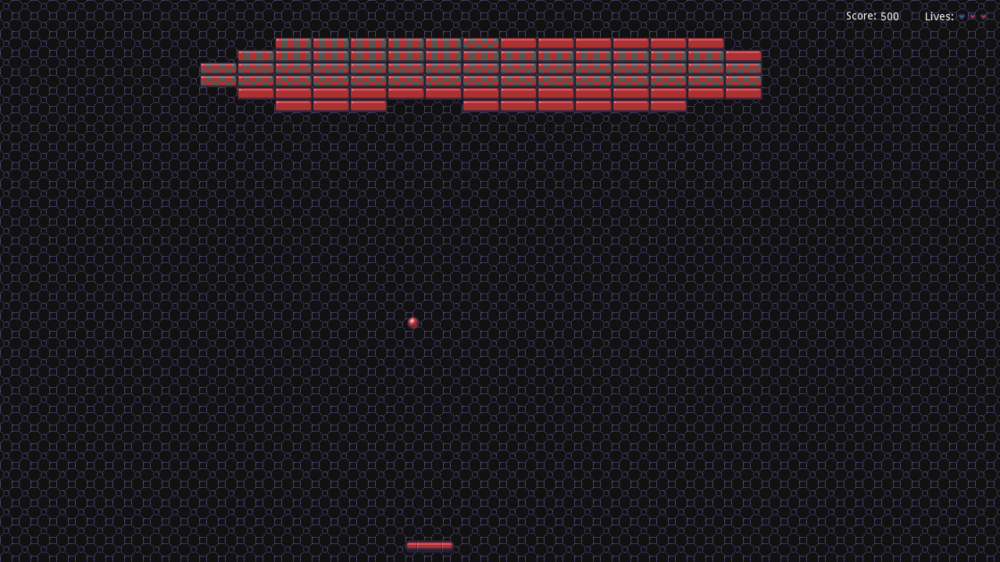

# BreakoutClone

Into the deep end with game development!  In an effort to get properly started with game dev and to stop making excuses, I've decided to make clones of some common and fairly popular games and game genres.  For the 2D portion, I have decided to work with the Godot engine as it seems to be a very friendly environment, open source, free, and fun to use.  This is the first game I've made on the engine, and as a first project I've decided upon making a Breakout clone.

## Learning Objectives

As it's a first project, I didn't want to go all out on polish but to instead use this as an opportunity to gain a general familiarity with the engine and the editor.  That being said, no plish would mean that I wouldn't get to try out the variety of tools and that's also a no-go.  Here, I worked on manually handling the physics involved, using the in-built collision detection to power it.  I also used a number of spritesheets from which to pull resources and some music and sound effects for added flair.  On a more general level, getting more familiar with the scripting language GDScript (which is quite close to Python) was a learning goal here.  Other tools were experimented with but everything was on a pretty surface level but ready to be dived into further in future projects.  One notable, not strictly gaming-related but more user experience related aspect here is the interface which needs a lot of work.

## Result

The result can be seen in the screenshot below.

The game starts with a splash screen and then randomly selects one of 3 available levels for you to play through.  Broken bricks increase the score and lives are deducted on missing the ball.  If the level is completed without dying 3 times, then another level is randomly selected and this will continue until all lives are exhaused.  The ball is fired at a random downward angle on launch each time and while walls and bricks bounce the ball in a fairly expected manner, contact with the paddle launches the ball at an angle in relation to the contact point in order to give the player more control over where the ball goes.

## Resource Attribution

All resources which were not my creations are attributed in [attribution.md](attribution.md).
